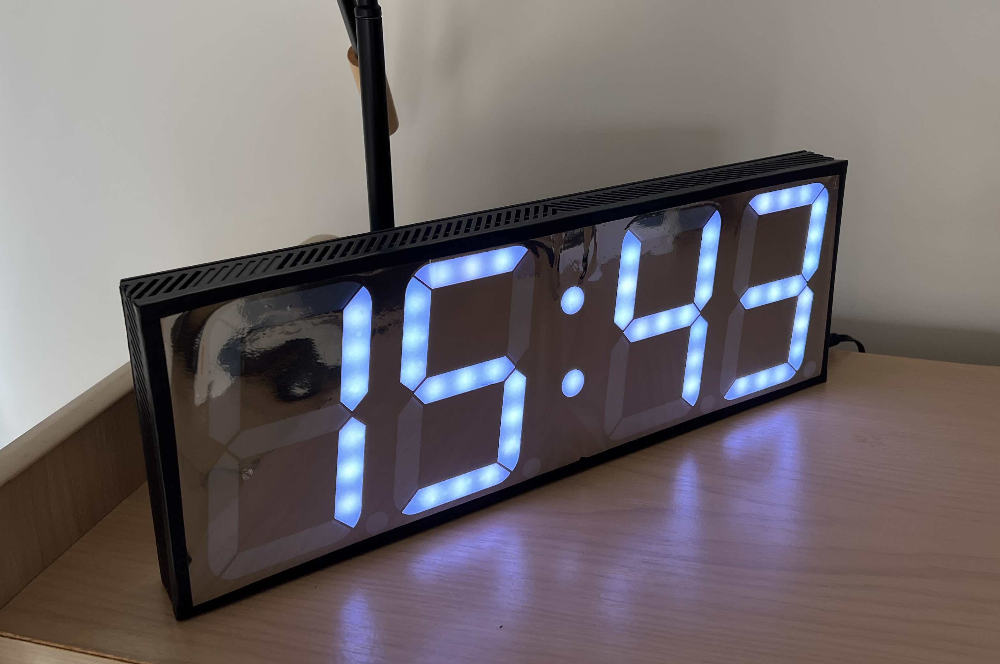
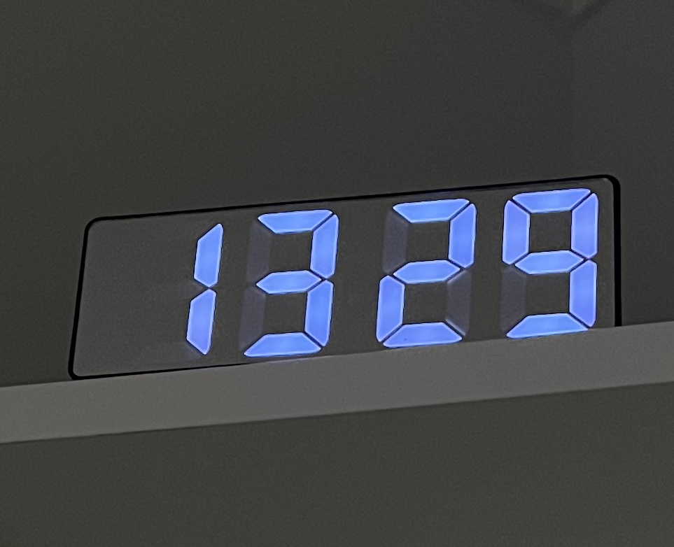
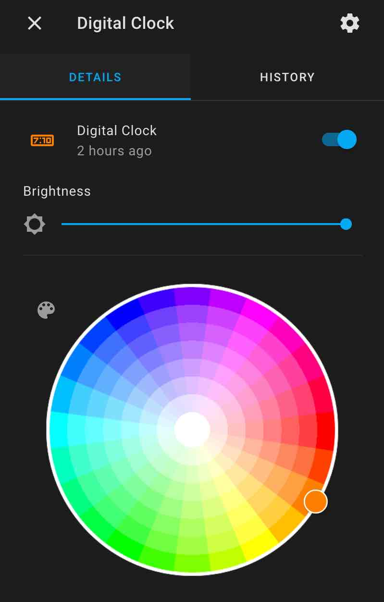
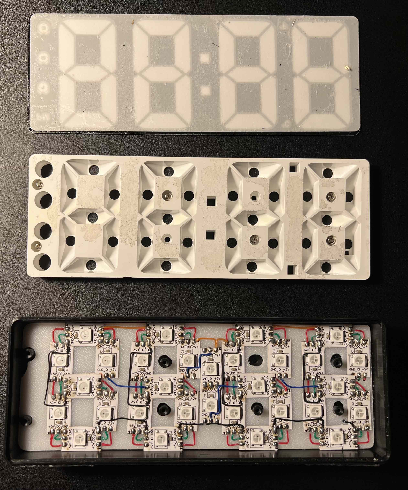

# ESPHome Component: Addressable Light Digital Display

[](images/big_digital_display_by_dawei_zhang_202011.jpg) 
[](images/small_digital_display_by_dawei_zhang_202201.jpg) 
[](images/home_assistant_control.jpg)

This component enables ESPHome to drive an eight-segment display made from FastLED strip with simple configuration.

Comparing to LED matrix and traditional 7-segment display, this display has unique advantages. 
  - It is not constrained by display size or DPI. You can create a large sharp digital display with minimal number of LEDs. It costs much less than using large eight-segment LED modules. 
  - The display can be extended easily. Displaying more digits doesn't increase circuit complexity. Most FastLED can be extended with 3 to 4 wires only in a serial way. No additional ICs or ports required.
  - Higher brightness can be achieved by using more LEDs.
  - Both brightness and colour can be easily controlled.

It's an ESPHome-based general digital display, it can be used for different purposes. For example, it can display date, time, room temperature, noise level etc. Data can also be pulled from Home Assistant.

This project is inspired by the following DIY solutions. 

* [7 segment clock by random1101 for ESPHome
by Alex18881](https://www.thingiverse.com/thing:4689116)
* [DIY BIG CLOCK - USB POWERED NIST SERVER TIME KEEPING by  Ivan Miranda](https://www.youtube.com/watch?v=PixXKK8N_wA)

## DIY advices

### Preparation 

To build a similar digital display, you need the following components:

- LED * N: Any model listed [here](https://esphome.io/components/light/fastled.html#supported-chipsets) is supported, for example `WS2812B`. Bigger display may draw higher power, choose higher votage model can reduce current requirement. 
- A MCU: You need one that ESPHome supported, such as [NodeMCU ESP32](https://esphome.io/devices/nodemcu_esp32.html)
- Power supply: Please make sure the power supply can cope with the maximum load of LEDs and still be able to power the MCU.
- A case: You can buy an existing LED clock and retrofit it or create one use 3D printer.
- Wires: connect LEDs, MCU and power supply
- A power connector: to connect power supply to your display
- A step down voltage converter: (optional) If you choose 12V LED, you need to convert power to 5V for MCU. 

### Design

The display below uses 30 LEDs (WS2812B) and one NodeMCU ESP32, which can be powered directly via USB 5V 2A power adapter. (5V 1A power is not enough for maximum brightness.)

For each digit to display, LED sequence doesn't matter, because you can configure it later, but it's better to keep the sequence consistent across all digits. 

Besides 7-segment symbols, you can also add special symbols to the display. Currently period `.` and colon `:` are supported.

[](images/small_digital_display_disassembled_by_dawei_zhang_202201.jpg) 

In this case, for each digit, LEDs are connected in the sequence of `BAFEDCG`. The green and blue wires are for data, starting from right to left. 
```
      A
     ---
  F |   | B
     -G-
  E |   | C
     ---
      D
```
### Wiring

Connect the LED in serial way, starting from RIGHT to LEFT of the display. There should be only 3 to 4 wires, 2 of which connect to power supply. Connect the rest to microcontroller. GND is shared by both power supply and microcontroller. 

## Configuration

### Examples
- [Digital Clock](examples/digital_clock.yaml) supports Internet SNTP time synchronization and daylight time auto-switch.

### Import display component
- `ref`: can either be a branch name (such as `main`) or a tag name (such as `v0.1.0`)

Read more about external components [here](https://esphome.io/components/external_components.html).

```yaml
external_components:
  - source:
      type: git
      url: https://github.com/daweizhangau/esphome_addressable_light_digital_display
      ref: main
    refresh: 0s
```

### Light component

`id` is required for display component to reference. Make sure correct `chipset`, `pin`, `num_leds` and `rgb_order` is set. This light doesn't need to expose to Home Assistant, so `internal: true`. 

```yaml
light:
  - platform: fastled_clockless
    internal: true
    id: internal_light_state
    chipset: WS2812B
    pin: GPIO33
    num_leds: 90
    rgb_order: GRB
```

### Display component

The display component is exposed as a light to Home Assistant, but it references the FastLED light.

- `platform`: must be `addressable_light_digital_display`
- `id`: ID of the display
- `light_id`: ID of the display light
- `name`: (Optional) Readable name of the display
- `icon`: (Optional) MDI icon ID
- `addressable_light_id`: FastLED light ID defined above
- `restore_mode`: (Optional) Recommended to set it to `ALWAYS_ON` otherwise, you need to turn it on in Home Assistant before it can display anything.
- `default_transition_length`: (Optional) Recommended to set it to `0s`.
- `led_map`: A string that maps LED to the 7 segments (shown below) and special symbols. From left to right, the map string starts from the first LED to the last LED. Each character in this string map to a LED, space is used as a delimiter. `A` to `G` is used to map a LED to corresponding segment of 7-segment, `.` and `:` are used to map corresponding symbols. These characters can be repeated. For example, if 3 LEDs are used to represent Segment B and 3 are used for Segment A, then map string is `BBBAAA`.
- `reverse`: (Optional) Content order. If true, the first led maps to right most character of content string, otherwise, the first LED maps the left most character. True, by default.
- `lambda`: C++ code to formulate display content. 
For more information about print API, please read [printable.h](components/addressable_light_digital_display/printable.h). 
For more information about suported characters, please read [ascii_to_raw.h](components/addressable_light_digital_display/ascii_to_raw.h)
To print time, [`time` component](https://esphome.io/components/time.html) is required.

```yaml
display:
  - platform: addressable_light_digital_display
    id: digital_clock
    light_id: digital_display_light
    name: Digital Clock
    addressable_light_id: internal_light_state
    icon: "mdi:clock-digital"
    restore_mode: ALWAYS_ON
    default_transition_length: 0s
    led_map: ". CCCDDDEEEFFFAAABBBGGG . CCCDDDEEEFFFAAABBBGGG :: . CCCDDDEEEFFFAAABBBGGG . CCCDDDEEEFFFAAABBBGGG"
    reverse: true
    update_interval: 500ms
    lambda: |-
      if (millis() % 1000 < 500)
        it.strftime("%H:%M", sntp_time->now());
      else
        it.strftime("%H %M", sntp_time->now());
```
